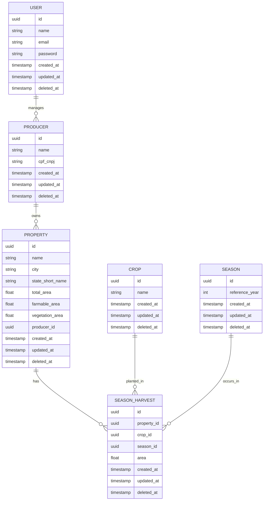

# Rural Assets API

This project is a backend API for managing rural producers, their properties, and related assets. It is publicly available at:

https://rural-assets-api.onrender.com

## Features

- User registration and authentication (JWT)
- Role-based access control (STAFF/USER)
- Producer management (CRUD)
- Property management (CRUD)
- Crop management (CRUD)
- Season management (CRUD)
- Season harvest management (CRUD)
- Soft delete for all entities
- Validation: Ensures farmableArea + vegetationArea does not exceed totalArea for properties
- PostgreSQL integration (via DATABASE_URL)
- TypeORM migrations and soft delete support
- OpenAPI (Swagger) documentation
- Docker support
- Unit tests for service and controller layers

## How to run the project

### 1. Install dependencies

```bash
npm install
```

### 2. Configure environment variables

Create a `.env` file with:

```
DATABASE_URL=postgresql://<user>:<password>@<host>:<port>/<db>
SECRET=your_jwt_secret
```

### 3. Run migrations

```bash
npm run migration
```

### 4. Start the application

```bash
npm run start
```

The API will be available at http://localhost:3000

### 5. API Documentation

Access http://localhost:3000/api for Swagger documentation.

### 6. Docker (optional)

```bash
docker build -t rural-assets-api .
docker run -p 3000:3000 --env-file .env rural-assets-api
```

## Project Structure

- `src/` — Main source code
- `src/modules/` — Domain modules (e.g., producer, property, user)
- `src/core/` — Shared classes and utilities
- `src/db/` — Database configuration and migrations

## API Overview

### Users

- `POST /users` — Register a new user (STAFF only)
- `POST /users/login` — Authenticate and receive JWT
-

### Producers

- `GET /producers` — List all producers for the authenticated user
- `POST /producers` — Create a new producer
- `PATCH /producers/:id` — Update the name of a producer
- `DELETE /producers/:id` — Soft delete a producer

### Properties

- `GET /properties/:producerId` — List all properties for a producer
- `POST /properties` — Create a new property (validates area constraints)
- `PATCH /properties/:id` — Update a property (validates area constraints)
- `DELETE /properties/:id` — Soft delete a property

### Crops

- `GET /crops` — List all crops
- `POST /crops` — Create a new crop
- `PATCH /crops/:id` — Update a crop
- `DELETE /crops/:id` — Soft delete a crop

### Seasons

- `GET /seasons` — List all seasons
- `POST /seasons` — Create a new season
- `PATCH /seasons/:id` — Update a season
- `DELETE /seasons/:id` — Soft delete a season

### Season Harvests

- `GET /season-harvests` — List all season harvests
- `POST /season-harvests` — Create a new season harvest
- `PATCH /season-harvests/:id` — Update a season harvest
- `DELETE /season-harvests/:id` — Soft delete a season harvest

## Validation Example

A property is only valid if:

```
farmableArea + vegetationArea <= totalArea
```

If this rule is violated, the API will return a 400 Bad Request with a clear error message.

## Entity Relationship Diagram (ERD)



This diagram shows the relationships between users, producers, properties, crops, seasons, and season harvests in the system.

## License

MIT
